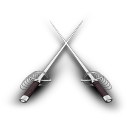
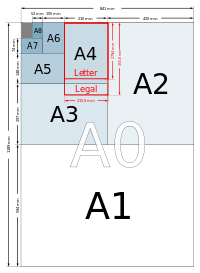
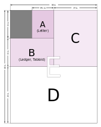
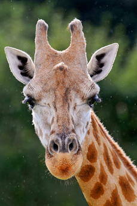
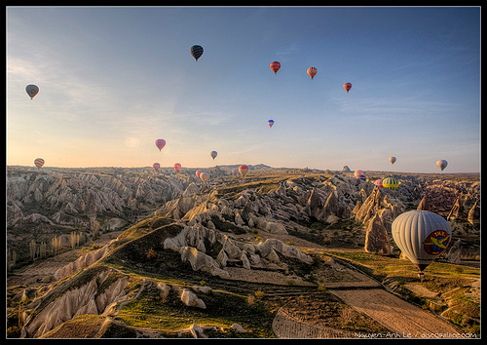

#  Paper cut 

Paper cut is a command-line tool for cutting images into paper-sized chunks so they can be printed on multiple pages with the
minimal amount of whitespace possible. This is most useful for printing web-design layouts, which are usually very
long with an extremely low aspect ratio. 

## Requirements

- Python 2.6 or 2.7
- ImageMagick
 
To install the required python libraries run:
    
    sudo pip install -r requirements.txt

## Quickstart

Paper cut operates on directories, rather than on a per-file basis. This is extremely useful to process a large amount
of images in one step. Lets assume you have a directory `input` with several images, maybe even nested directory structures.

    python paper-cut.py input/ output/
    
Running the above command will create a directory `output`, if not present, and generates an identical directory structure
as in `input`. For every source image, you will find one or more files with the following naming scheme: 
`<name>-0.png`, `<name>-1.png`, `<name>-2.png`, ... Extensions are preserved, `png` is just an example here.
    
Note: The slashes at the end of the arguments in the previous examples just indicate, that `input` and `output` are 
directories rather than files. You are free to omit them.

Just run the following command for more details:

    python paper-cut.py --help
    
## Features

### Paper sizes

Paper-cut supports several different paper sizes:

#### DIN

A0 - A10, default is A4

#### ANSI

Ledger, Legal, Letter and Tabloid

You can specifiy the paper size with the `-s`/`--size` argument switch:

    python paper-cut.py --size A5 input/ output/

### Orientation

As you can see, `paper-cut` supports different paper orientations: [Portrait](http://www.flickr.com/photos/tambako/5186755209/) and 
[Landscape](http://www.flickr.com/photos/discopalace/4556532008/):

To specify a paper orientation use the `-o`/`--orientation` switch:

    python paper-cut.py --orientation landscape input/ output/
    
You can of course combine `--size` and `--orientation`:

    python paper-cut.py --size A5 --orientation landscape input/ output/

## Attributions

Swords Icon by [Archigraphs](http://www.iconarchive.com/show/assassins-creed-icons-by-archigraphs/Swords-icon.html) is licensed under a
[Creative Commons (Attribution-NonCommercial-NoDerivs 3.0 Unported)](http://creativecommons.org/licenses/by-nc-nd/3.0/).

Portrait of a giraffe by [Tambako the Jaguar](http://www.flickr.com/photos/tambako/) is licensed under a
[Creative Commons (Attribution-NoDerivs 2.0 Generic)](http://creativecommons.org/licenses/by-nd/2.0/).

Cappadocia in a hot air balloon by [discopalace](http://www.flickr.com/photos/discopalace/) is licensed under a
[Creative Commons (Attribution-NonCommercial-NoDerivs 2.0 Generic)](http://creativecommons.org/licenses/by-nc-nd/2.0/).

